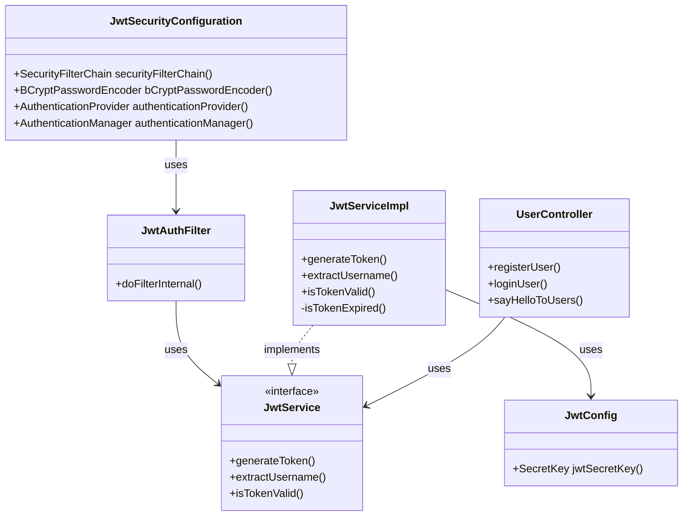
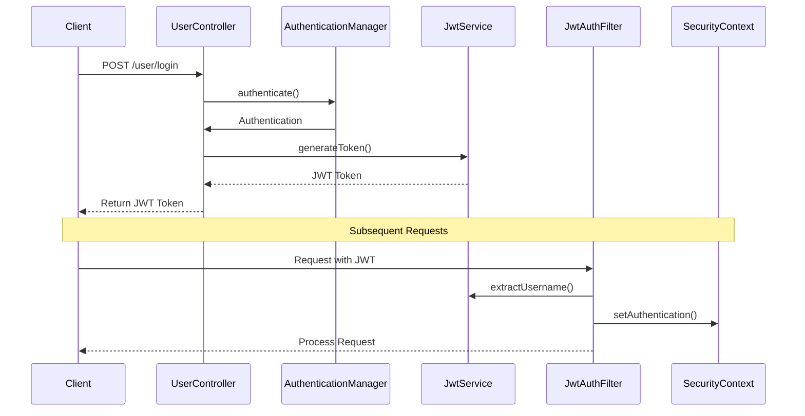

# JWT Authentication and Authorization

This document explains the JWT (JSON Web Token) based authentication and authorization implementation in the project.

## Architecture Overview



## Authentication Flow



## Component Details

### 1. JwtSecurityConfiguration
- Main security configuration class
- Configures security filter chain
- Sets up authentication providers
- Manages password encoding
- Configures stateless session management

### 2. JwtAuthFilter
- Extends OncePerRequestFilter
- Intercepts incoming requests
- Validates JWT tokens
- Sets up authentication in SecurityContext
- Key methods:
  - `doFilterInternal`: Processes each request
  - Validates Authorization header
  - Extracts and validates JWT

### 3. JwtService Interface
```java
public interface JwtService {
    String generateToken(UserDetails userDetails);
    String extractUsername(String token);
    boolean isTokenValid(String token, UserDetails userDetails);
}
```

### 4. JwtServiceImpl
- Implements JwtService interface
- Handles JWT operations:
  - Token generation
  - Username extraction
  - Token validation
  - Expiration checking

### 5. JwtConfig
- Provides JWT-related beans
- Generates secure secret key for JWT signing
- Uses HS256 algorithm for token signing

## Security Features

1. **Token Generation**
   - Uses HS256 algorithm
   - Includes user details
   - Sets expiration time
   - Signs with secure key

2. **Token Validation**
   - Verifies token signature
   - Checks token expiration
   - Validates user details
   - Ensures token integrity

3. **Security Measures**
   - Stateless session management
   - CSRF protection disabled for API
   - Secure password encoding
   - Protected endpoints

## API Endpoints

1. **Public Endpoints**
   - `POST /user/register`: User registration
   - `POST /user/login`: User authentication

2. **Protected Endpoints**
   - `GET /user/hello`: Requires valid JWT

## Request Flow

1. **Login Process**
   ```
   Client -> POST /user/login
   -> AuthenticationManager validates credentials
   -> JwtService generates token
   -> Client receives JWT
   ```

2. **Protected Resource Access**
   ```
   Client -> Request with JWT in Authorization header
   -> JwtAuthFilter intercepts
   -> Validates token
   -> Sets up SecurityContext
   -> Processes request
   ```

## Best Practices Implemented

1. **Security**
   - Secure token generation
   - Token expiration
   - Secure password storage
   - Protected endpoints

2. **Code Organization**
   - Separation of concerns
   - Interface-based design
   - Clean architecture
   - Dependency injection

3. **Error Handling**
   - Token validation
   - User authentication
   - Request processing 