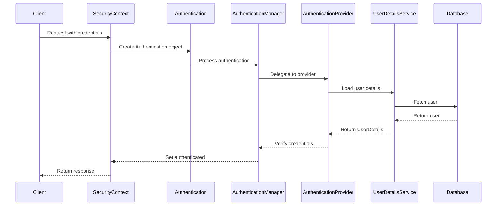
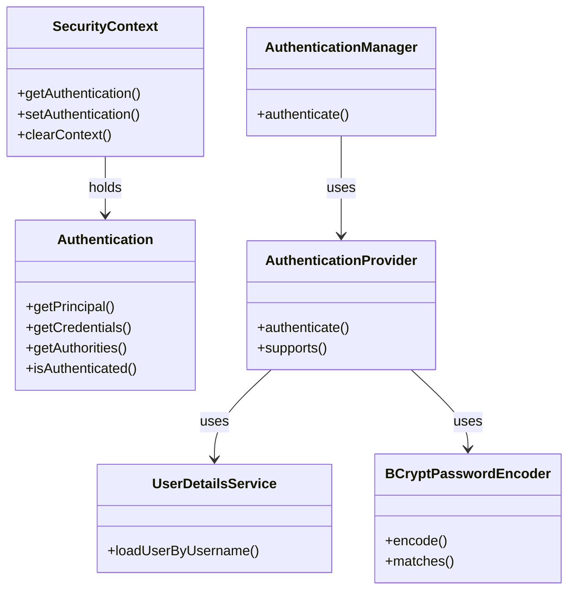
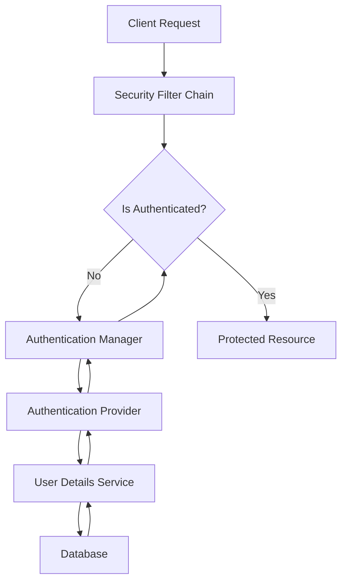

# Spring Security Architecture

This document explains the Spring Security architecture implemented in this project using Mermaid.js diagrams.

## Core Components

### 1. Security Context and Authentication Flow

### 2. Class Relationships

### 3. Authentication Process Flow

## Component Details

### 1. SecurityContext
- Holds the current security context
- Contains the Authentication object
- Thread-local storage of security information
- Used throughout the application to check authentication status

### 2. Authentication
- Represents the authentication request/response
- Contains:
  - Principal (user identity)
  - Credentials (password)
  - Authorities (roles/permissions)
  - Authentication status

### 3. AuthenticationManager
- Main interface for authentication
- Coordinates the authentication process
- Delegates to appropriate AuthenticationProvider
- Returns fully populated Authentication object

### 4. AuthenticationProvider
- Performs actual authentication
- Uses UserDetailsService to load user data
- Verifies credentials using PasswordEncoder
- Implements specific authentication strategies

### 5. UserDetailsService
- Loads user-specific data
- Used by AuthenticationProvider
- Returns UserDetails object
- Connects to database for user information

### 6. Password Encryption (BCrypt)
- Securely hashes passwords
- Implements one-way encryption
- Provides password verification
- Uses salt for additional security

## Implementation in Project

In this project, these components are implemented as follows:

1. **SecurityContext**: Managed by Spring Security automatically
2. **Authentication**: Created during login/registration
3. **AuthenticationManager**: Configured in SecurityConfiguration
4. **AuthenticationProvider**: Custom implementation using DaoAuthenticationProvider
5. **UserDetailsService**: CustomUserDetailsService implementation
6. **Password Encryption**: BCryptPasswordEncoder for secure password storage

## Security Flow in Project

1. User submits credentials
2. SecurityContext creates Authentication object
3. AuthenticationManager processes request
4. AuthenticationProvider verifies credentials
5. UserDetailsService loads user data
6. BCryptPasswordEncoder verifies password
7. SecurityContext is updated with authenticated user 